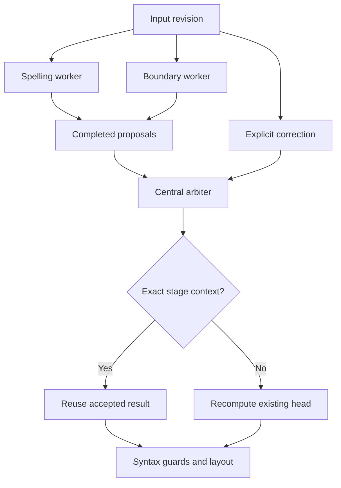

# Parallel local inference: first implementation

Base: `d26507d018044e4421b4a5550a03ff621de091fc`.
This change wires existing local heads into speculative workers. It does not
train a semantic encoder, add weights, infer arbitrary sentence meaning, or
promise improved linguistic accuracy. Existing unresolved holdout errors remain.

## Execution

After 400 ms without an input change, the UI starts two independent expert jobs
on the same immutable revision: the existing source/log spelling ranker and the
existing sentence-boundary network. IME composition pauses preparation. Input
changes invalidate results immediately; an active expert finishes its current
job but retains only the latest queued revision. Draft preparation never changes
the textarea, logs a draft, or writes training data.

On explicit correction, `EditorClient` passes only already-completed proposals
for the exact current text to the existing central editor worker. It never waits
for a speculative head. The central arbiter checks revision, original spans,
protected ranges, valid spelling surfaces, punctuation insertion constraints,
conflicting outputs and overlapping offsets. Proposed edits use UTF-16 offsets
relative to the immutable input of that particular model stage, not offsets into
a subsequently rewritten document.

Each stage reuses a proposal only when its input is byte-identical to the
proposal's context. If an earlier spelling, lexical, formatting or clause step
changed that context, the established model reruns on the new context. This
prevents a speculative sentence boundary being applied after its words changed.
Partial head outputs are never merged. The established syntax guard and final
layout remain authoritative. Both text and mail strategies use the same hook;
structured Markdown, HTML, links and code skip speculation and retain the
existing lossless scanners.



The speculative pool runs only with at least four reported logical CPU cores
and without the browser's data-saver flag. Otherwise the existing single worker
runs. The maximum is three workers, including the central worker. A speculative
failure or five-second watchdog disables the optional pool and leaves explicit
correction available. The central ten-minute watchdog is unchanged. Bundled
model/dictionary dependencies are duplicated in worker memory: CPU count is a
coarse resource heuristic, not a RAM measurement. No LLM, external inference
API, Python runtime, GPU, or additional model download is introduced. Workers
and dynamic chunks are normal same-origin application assets; they must finish
loading before those heads can operate offline.

## Verification

| Check | Result |
| --- | --- |
| Original suite | 4,093 passed |
| Suite with arbitration/concurrency tests | 4,099 passed |
| Pre-change fixture output comparison | 4,861 text rows unchanged |
| Mail path comparison | 340 rows unchanged |
| Second correction pass | Stable on all 4,861 text rows |
| Frozen gold | 1,000/1,000 exact; baseline gate passed |
| Fresh / priority gates | 30/30 and 24/24 |
| Typecheck / ESLint / production build | Passed |
| Enforced benchmark | Passed, unchanged thresholds |
| Model JSON growth | 0 KB; existing artifacts unchanged |
| Production browser, 8-core profile | 3 workers; accepted spelling-stage reuse observed |
| Production browser, 2-core profile | 1 worker; correction succeeds |
| Browser rapid replacement / mail / blocked API routes | Passed; no page errors |

The A/B script observed 5,494 exact-context model reuse operations and 5,253
recomputations; it accepted no rejected proposal. The rejection paths are tested
separately with stale versions, invalid surfaces, protected spans, overlapping
edits and punctuation replacement. These project fixtures are engineering
regressions, not independent human-reviewed language evaluation.

The recorded Node medians were 97.5 ms direct versus 61.4 ms prepared final
execution at 200 words, and 355.1 versus 265.1 ms at 900 words. Preparation also
cost 34.9 and 108.5 ms respectively. This run overlapped other validation jobs;
these values **do not establish an end-to-end speedup**. Speculation moves work
before a click and sometimes duplicates it. Browser first-click results also
include worker initialization: see the raw browser report. No accuracy or
latency baseline was modified.

Reproduce the output comparison after preparing the dictionary:

```sh
node --import tsx scripts/audit-editor-performance.ts --out=/tmp/base-snapshot
node --import tsx scripts/check-parallel-inference.ts \
  --baseline=/tmp/base-snapshot/snapshot.json --out=/tmp/parallel-results.json
npm test
npm run typecheck
npm run lint
npm run build
npm run benchmark:check
npm run gold:check
npm run gold:exact
npm run local-ai:fresh:check
npm run quality:priorities
```

For a genuine pre-change comparison, create `/tmp/base-snapshot` from the base
commit first. Raw reports are [verification.json](verification.json) and
[browser-check.json](browser-check.json). Browser checks used the production
Turbopack build with API routes aborted, asserted unchanged draft handling and
the selected subject-free mail greeting, and covered both resource profiles.
The environment's agent-browser daemon could not start; direct local Playwright
with Chromium was used instead. No browser-test dependency was added to the app.

## Next step

A compact, independently evaluated contextual detector could prioritize expert
jobs and reduce wasted boundary speculation. It needs real annotated sentence
pairs and calibrated task-specific confidence, not another rule labeled as
semantic understanding. This first implementation deliberately preserves the
existing final decision path while introducing safe parallel execution.
